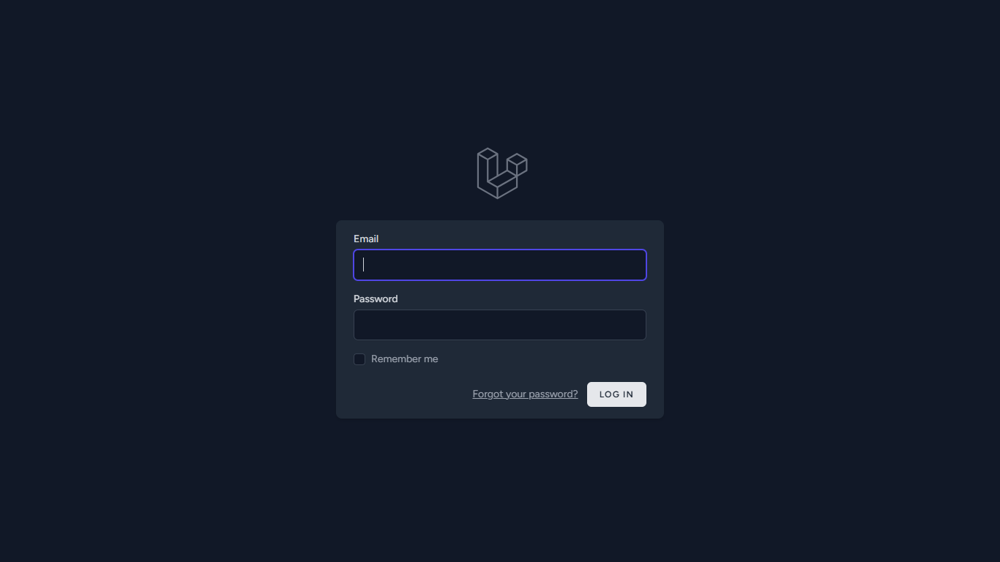
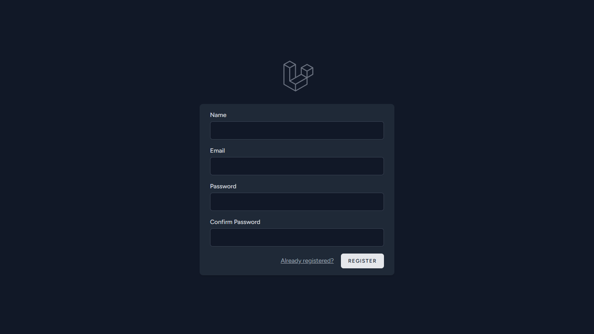

# 🔐 Laravel Breeze Auth (Laravel 12)

Este es un proyecto base de autenticación utilizando **Laravel 12** y **Laravel Breeze**, ideal como punto de partida para tus aplicaciones Laravel. Incluye las funcionalidades básicas de registro, inicio de sesión y cierre de sesión.

---

## 🧰 Tecnologías utilizadas

- ⚙️ Laravel 12
- 🎨 Tailwind CSS (para el diseño)
- 🧱 Laravel Breeze (starter kit)
- 🖌 Blade (motor de plantillas)

---

## 🚀 ¿Qué es Laravel Breeze?

[Laravel Breeze](https://laravel.com/docs/starter-kits#laravel-breeze) es un **starter kit simple y ligero** para autenticación en Laravel.

Te proporciona:

- Registro de usuarios
- Inicio y cierre de sesión
- Validaciones de formulario
- Estilo base con Tailwind CSS
- Código limpio y fácil de extender

---

## 🖼️ Capturas de pantalla

### 🔐 Login


### 📝 Registro


> ⚠️ Asegúrate de subir las imágenes a `public/docs/screenshots/` en tu repositorio.

---

## 📦 Instalación del proyecto

```bash
# Clona el repositorio
git clone https://github.com/rick672/Auth-Breeze.git

# Entra al proyecto
cd Auth-Breeze

# Instala dependencias de PHP
composer install

# Copia el archivo de entorno
cp .env.example .env

# Genera la key
php artisan key:generate

# Configura tu base de datos en el archivo .env

# Ejecuta las migraciones
php artisan migrate

# Instala dependencias de frontend
npm install && npm run dev

# Inicia el servidor
php artisan serve
